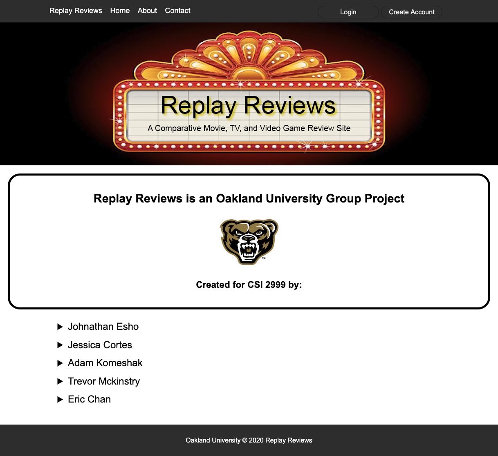

# Replay Reviews Project
Replay Reviews is a website that can search for movies, tv shows, and video games and display their relevant information with options to view reviews from different websites, such as RottenTomatoes, IMDB, MetaCritic, and RogerEbert. Users, who create an account, are able to view and enter comments on any movie, tv show, or video game of their choice.
	
## Technologies
Project is created using:
* HTML5
* CSS3
* JavaScript
* PHP 5
* Bootstrap 4
* phpMySql
	
## Setup
This website cannot be hosted on GitHub since Github only supports static websites. 
To run this project, install:

* Entire project folder
* XAMPP (if you dont already have software to host PHP websites on your localhost)
* Text Editor

## Sources
* Open Movie Database (OMDB) API- http://www.omdbapi.com/
* RAWG API - https://rawg.io/apidocs
* AXIOS JavaScript Library - https://github.com/axios/axios

## Screenshots

### Home page with search results displayed:

### Movie result page with relevant information about the movie, options to choose from different review sites to be relocated to, option to include comments, and past comments from different users displayed: 

### Contact page displayed:

